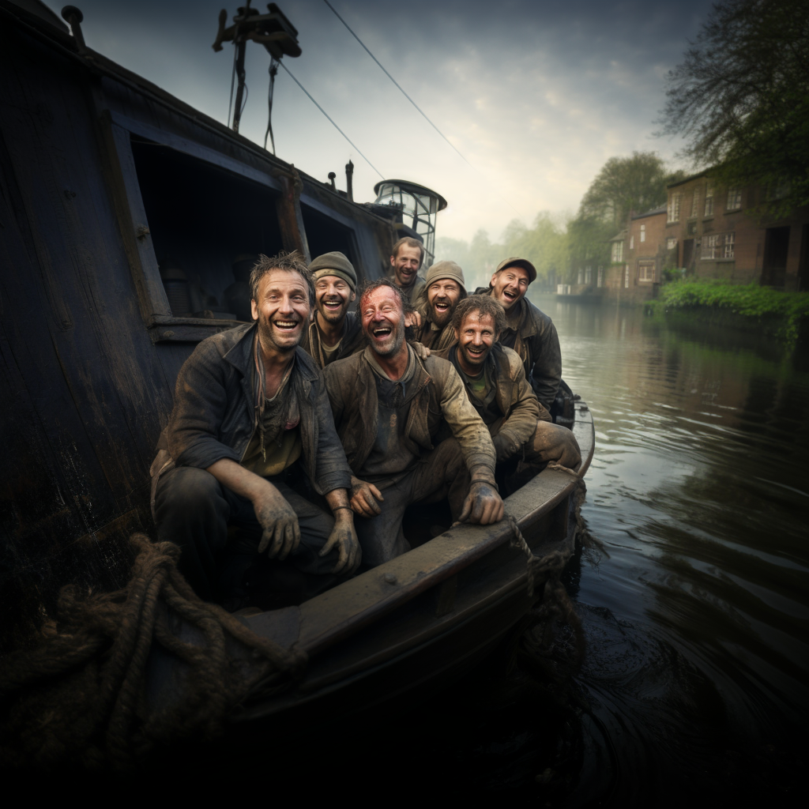
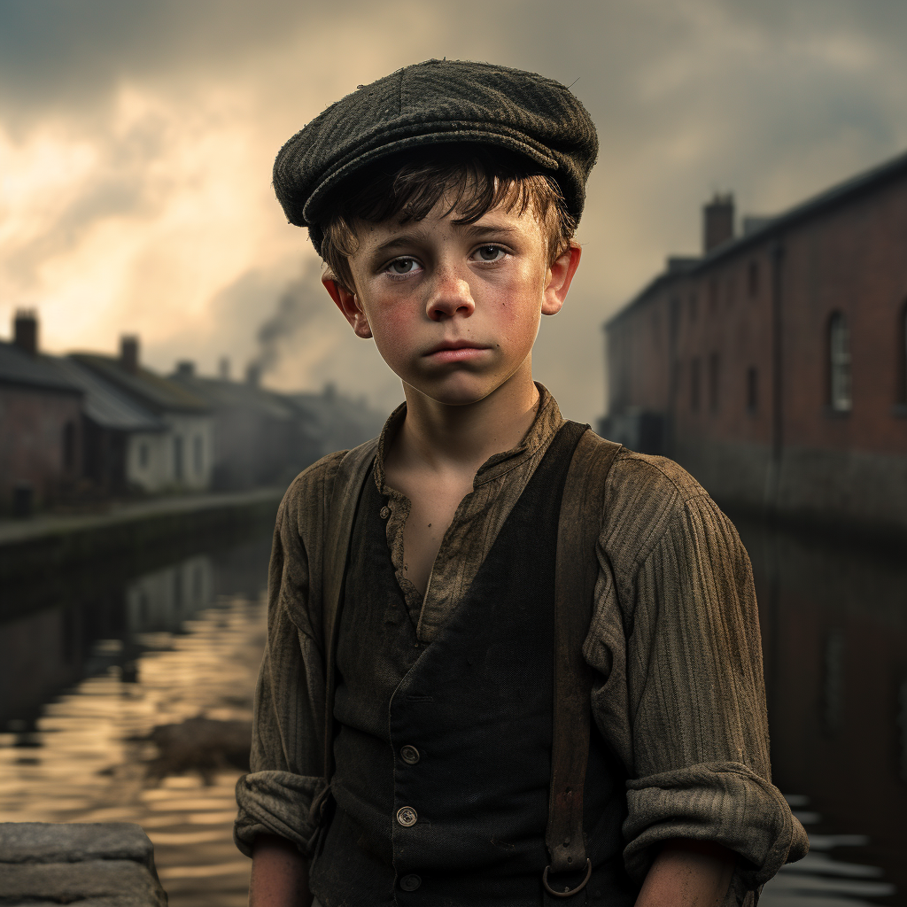
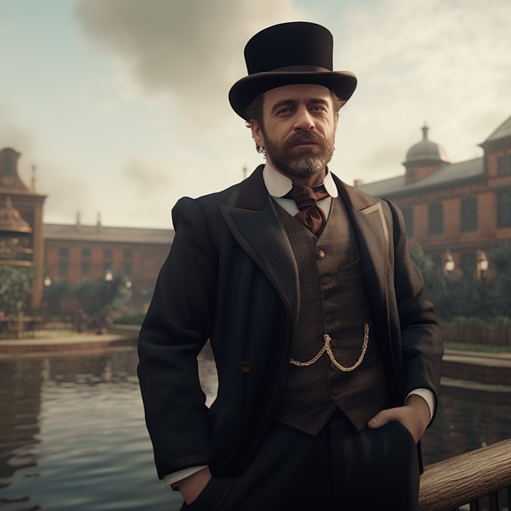

# Canals

You (the protagonist) inherit a boat from your late granddad, setting the stage for your journey into the world of canal boating. You are completely inexperienced and lack any knowledge about operating a boat.

As you start exploring the canals, you encounter a group of people who doubt your boating abilities and taunt you. Their mockery challenges your determination to prove yourself.

Little Jimmy, a street-savvy kid who observes the situation, recognizes an opportunity to exploit your vulnerability. He offers insider information about the canals but tasks you with completing favors for him. Unbeknownst to you, Little Jimmy is involved in a deeper web of deceit.

Sawyer, a seasoned boater, initially indifferent to your struggles, becomes intrigued by your dedication and decides to mentor you. Unaware of Little Jimmy's ulterior motives, Sawyer provides guidance, genuinely believing in your potential.

Little Jimmy, resourceful and cunning, utilizes his ratpack of street kids to gather information and execute his deeds. He has been manipulated by a Corrupt Business Tycoon, Harrison Blackwood, who seeks to take control of the canals for their own business endeavors. Mr. Blackwood sees the canals as a valuable asset and aims to exploit them for profit. He manipulates Little Jimmy, using him as a pawn to carry out the sabotage, ensuring that his plans for canal dominance remain hidden.

Maria, a charismatic and adventurous fellow boater, befriends you and joins you on your boating journeys. With her keen instincts, she notices inconsistencies in the information provided by Little Jimmy. She questions the accuracy and reliability of his tips, suspecting that he might be misleading you for personal gain. Determined to uncover the truth, Maria starts her own investigation.

Maria's investigation leads her to uncover evidence connecting Little Jimmy to the sabotage plot, revealing his true nature as a cunning manipulator. She discovers that Jimmy's motive for sabotaging the locks is to create chaos and exploit the resulting confusion for his gang's criminal activities. Shocked and angered by the betrayal, you confront Little Jimmy, demanding answers.

Together with Maria and Sawyer, you devise a plan to thwart Little Jimmy and the sabotage plot. Utilizing your growing boating skills, Maria's sharp intuition, and Sawyer's expertise, you work as a team to prevent the locks from being tampered with. By foiling Jimmy's plan, you ensure the safety of the canals and protect the community from his destructive actions.

The evidence connecting Harrison Blackwood to the sabotage plot is presented to the authorities, and he faces consequences for his actions.

With justice served, the canal community comes together to rebuild and thrive. The protagonist, Maria, and Sawyer play integral roles in restoring the canal's integrity and ensuring its continued safety.
